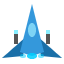
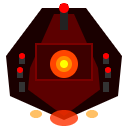
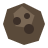
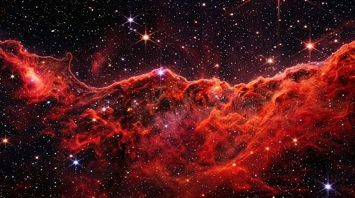

# Nebula Assault

**Nebula Assault** é um jogo arcade espacial de tiro e ação (Shoot 'em up) onde você assume o papel de um piloto destemido em uma missão épica para conquistar estrelas e derrotar deuses cósmicos. O jogo conta com um sistema profundo de evolução, habilidades ativas, dezenas de inimigos diferentes e batalhas épicas contra chefes.

---

## 🚀 Tecnologias Utilizadas

Este projeto foi desenvolvido inteiramente com tecnologias web nativas, sem o uso de engines de jogos externas (como Unity ou Godot) ou frameworks pesados.

- **HTML5**: Estrutura do jogo, HUD (Heads-Up Display) e menus.
- **CSS3**: Estilização de interface, animações de transição e layouts dinâmicos.
- **JavaScript (ES6+)**: Toda a lógica de jogo, física, inteligência artificial de inimigos, sistema de progressão (XP/nível), loja de upgrades e controle de estado do jogo.
- **HTML5 Canvas 2D API**: Responsável por toda a renderização gráfica do jogo, incluindo sistema de partículas, desenhos procedurais de sprites e efeitos visuais.
- **Web Audio API**: Gerenciamento e reprodução de efeitos sonoros e músicas de fundo.

---

## 🎮 Funcionalidades e Características

- **Campanha Dinâmica**: Múltiplas fases com níveis crescentes de dificuldade, diferentes ondas de inimigos e cenários interativos (como cinturões de asteroides).
- **Hangar & Loja de Upgrades**: Gaste o ouro coletado em batalhas para melhorar o dano, escudo, taxa de acerto crítico, roubo de vida (lifesteal) e muito mais.
- **Skins & Personalização**: Desbloqueie diferentes aparências para sua nave e piloto.
- **Habilidades Especiais (Skills)**: Equipe até 3 habilidades ativas simultâneas (como escudos temporários, super ataques ou drones aliados) para ajudá-lo na batalha.
- **Mais de 10 Tipos de Inimigos**: Desde "Scouts" ágeis até "Paladinos" couraçados e naves "Healers" que curam outras naves.
- **Batalhas Épicas de Bosses**: Inimigos massivos com padrões de ataque complexos.
- **Controles Híbridos**: Suporte para modo de tiro manual ou automático.

---

## 🕹️ Controles

| Tecla / Comando | Ação |
|---|---|
| `W`, `A`, `S`, `D` ou `Setas` | Mover a nave |
| `Espaço` | Atirar (no modo manual) |
| `F` | Alternar entre tiro Automático e Manual |
| `Shift` | Ativar habilidade equipada |
| `1`, `2`, `3` | Trocar habilidade ativa |
| `TAB` / `ESC` | Pausar / Abrir Menu durante o jogo |

---

## 🖼️ Mídias e Assets

O jogo utiliza uma vasta coleção de sprites para naves, itens e partículas. Abaixo estão alguns exemplos de recursos gráficos presentes no projeto.

### Sprites (Personagens e Inimigos)

<table>
  <tr>
    <td align="center">
      <br>
      <b>Nave do Jogador</b>
    </td>
    <td align="center">
      <br>
      <b>Boss (Chefe Final)</b>
    </td>
    <td align="center">
      <br>
      <b>Inimigo: Paladin</b>
    </td>
    <td align="center">
      <br>
      <b>Inimigo: Fighter</b>
    </td>
  </tr>
</table>

### Itens e Obstáculos

<table>
  <tr>
    <td align="center">
      <br>
      <b>Power-Up: Cura</b>
    </td>
    <td align="center">
      <br>
      <b>Ouro / Loot</b>
    </td>
    <td align="center">
      <br>
      <b>Asteroide</b>
    </td>
  </tr>
</table>

### Vídeos (Fundos Animados)

*Os vídeos abaixo são utilizados como fundos atmosféricos de menus e fases (requer reprodução no navegador).*

<details>
  <summary><b>Clique para ver: Plasma Vortex</b></summary>
  <br>
  <video src="assets/backgrounds/plasma_vortex.mp4" controls width="400"></video>
</details>

<details>
  <summary><b>Clique para ver: Asteroid Belt Moving</b></summary>
  <br>
  <video src="assets/backgrounds/Asteroid_belt_moving.mp4" controls width="400"></video>
</details>

<details>
  <summary><b>Clique para ver: Red Star Explode</b></summary>
  <br>
  </img>
</details>

---

## ⚙️ Como Executar o Jogo

Por ser construído inteiramente com tecnologias web nativas, você pode jogar Nebula Assault rodando um simples servidor web local, para que os módulos e assets sejam carregados corretamente sem bloqueios de CORS.

1. **Clone o repositório ou baixe os arquivos.**
2. **Abra um servidor web local na pasta raiz do projeto.**
   - Usando Python 3:
     ```bash
     python -m http.server 8000
     ```
   - Usando Node.js (http-server):
     ```bash
     npx http-server
     ```
3. **Acesse no seu navegador:**
   - Abra `http://localhost:8000` (ou a porta que o seu servidor abriu) e clique em **NOVA CAMPANHA** para jogar!
